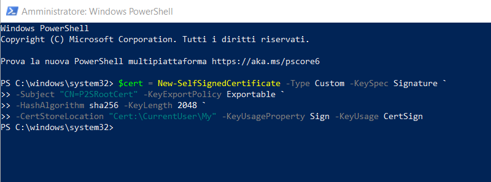
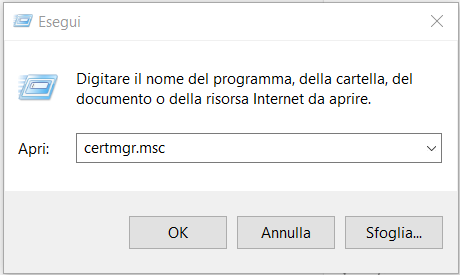
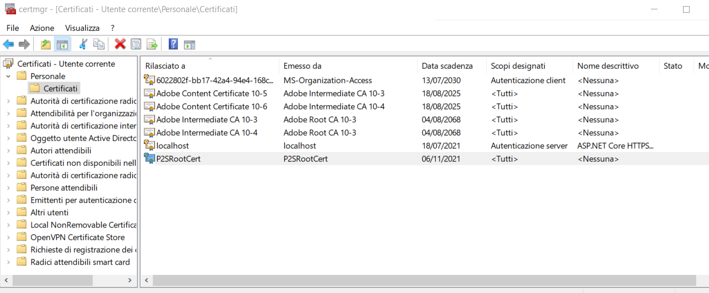

# Azure Point to Site VPN

creare VPN Gateway e Virtual Network

Generare Root Certificate e client certificate

Configurare VPN Gateway con root certificate

Generare Client VPN

Installare Client VPN

https://docs.microsoft.com/it-it/azure/vpn-gateway/vpn-gateway-howto-point-to-site-resource-manager-portal

https://docs.microsoft.com/it-it/azure/vpn-gateway/vpn-gateway-certificates-point-to-site

## VPN Gateway

## Root Certificate

## Client Certificate 

https://docs.microsoft.com/it-it/azure/vpn-gateway/point-to-site-how-to-vpn-client-install-azure-cert