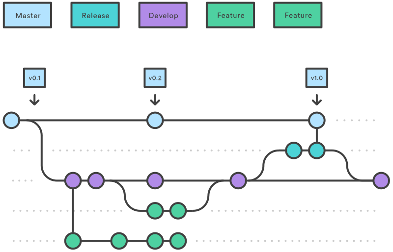

# Flusso di lavoro GIT (Git WorkFlow)

*Nota: parte del contenuto di questo documento è tratta ed adatta dal tutorial pubblicato da Atlassian  su [Git Tutorials](https://www.atlassian.com/git/tutorials/comparing-workflows)  con licenza  [Creative Commons Attribution 2.5 Australia License](http://creativecommons.org/licenses/by/2.5/au/).*

Non esiste un flusso di lavoro (*workflow*) GIT ideale per tutti i progetti e per tutti i team di sviluppo.  Nella documentazione pubblicata da Atlassian BitBucket ci sono degli [articoli](https://www.atlassian.com/git/tutorials/comparing-workflows) che descrivono e comparano i workflow più comunemente utilizzati.  Quello descritto in questo documento è un adattamento del GitFlow workflow che è stato proposto per la prima volta da  [Vincent Driessen at nvie](http://nvie.com/posts/a-successful-git-branching-model/). 

## GitFlow Workflow

The Gitflow Workflow defines a strict branching model designed around the project release. GitFlow, it assigns very specific roles to different branches and defines how and when they should interact. Gitflow is really just an abstract idea of a Git workflow. This means it dictates what kind of branches to set up and how to merge them together. 

Per maggiori dettagli si rimenda al post orginale di [Vincent Driessen](http://nvie.com/posts/a-successful-git-branching-model/) e l tutorial di [Atlassian](https://www.atlassian.com/git/tutorials/comparing-workflows/gitflow-workflow)

## Braches

Nel repository sono presenti tre branch "globali" e numerosi branch legati allo sviluppo di specifiche feature, user stories, tak o bug.

I tre branch globali sono:

1. Master: contiene la versione di produzione del prodotto. L'automazione DevOps distribuisce automaticamente il contenuto di questo branch nell'ambiente di *collaudo*
1. Dev: contiene la versione di sviluppo prodotta nello Sprint corrente. L'automazione DevOps distribuisce automaticamente il contenuto di questo branch nell'ambiente di *test* condiviso da tutto il team di progetto

Nei progetti che utilizzano un framework di terze parti come base di partenza è presente anche un altro branch che viene aggiornato costantemente con l'ultima versione di riferimento del framework utilizzato e serve per incorporare le nuove funzionalità del framework all'interno del progetto.

Ed esempio se l'applicazione utilizza ASP.NET ZERO nel repository sarà presente anche il branch denominato aspnetzero

Altri branch utilizzati in circostanze specifiche sono:

- Feature branches
- HotFix Branches
- Release branches

## Developer e Master Branch

Instead of a single `master` branch, this workflow uses two branches to record the history of the project. The `master` branch stores the official release history, and the `develop` branch serves as an integration branch for features. It's also convenient to tag all commits in the `master` branch with a version number.

### Feature Brances

Each new feature should reside in its own branch, which can be [pushed to the central repository](https://www.atlassian.com/git/tutorials/syncing/git-push) for backup/collaboration. But, instead of branching off of `master`, `feature` branches use `develop` as their parent branch. When a feature is complete, it gets [merged back into develop](https://www.atlassian.com/git/tutorials/using-branches/git-merge). Features should never interact directly with `master`.

`Feature` branches are generally created off to the latest `develop` branch.

### Start Feature Branch

`git checkout develop git checkout -b feature_branch`

### Finish a Feature Branch

`git checkout develop git merge feature_branch`

## Release Branch

Once `develop` has acquired enough features for a release (or a predetermined release date is approaching), you fork a `release` branch off of `develop`. Creating this branch starts the next release cycle, so no new features can be added after this point—only bug fixes, documentation generation, and other release-oriented tasks should go in this branch. Once it's ready to ship, the `release` branch gets merged into `master` and tagged with a version number. In addition, it should be merged back into `develop`, which may have progressed since the release was initiated.

Using a dedicated branch to prepare releases makes it possible for one team to polish the current release while another team continues working on features for the next release. It also creates well-defined phases of development (e.g., it's easy to say, “This week we're preparing for version 4.0,” and to actually see it in the structure of the repository).

Making `release` branches is another straightforward branching operation. Like `feature` branches, `release` branches are based on the `develop` branch. A new `release` branch can be created using the following methods.

### Start Release Branch

`git checkout develop git checkout -b release/0.1.0`

### Finish Release Branch

`git checkout master git merge release/0.1.0`

## HotFix Branch

Maintenance or `“hotfix”` branches are used to quickly patch production releases. `Hotfix` branches are a lot like `release` branches and `feature` branches except they're based on `master` instead of `develop`. This is the only branch that should fork directly off of `master`. As soon as the fix is complete, it should be merged into both `master` and `develop` (or the current `release` branch), and `master` should be tagged with an updated version number.

